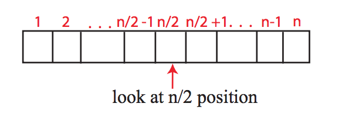
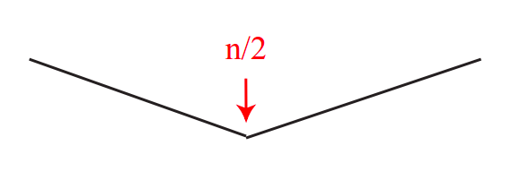

# Peak Finding

## One-dimensional Version

- **What is a peak ?**

Let's say that we have an array of elements of integers as follow,


we say that the position `2` is a peak if and only if `a <= b` and `c <= b`.

- **The problem** : Find a peak if it exists.

**Does it always exist?**

Well, let's prove this case by case. If the array elements are in an ascending order then the last position will be a peak, if they are in an descending order then the first position will be a peak, if they are not sorted then we will have something like this `[1,5,2,6,7]` so we will definitely find a peak. There remains one last case in which we have equal elements next to each other like this case `[1,3,3,2`] or the case where all elements are equal, for example : `[2,2,2,2,2]`, in this case we also have a peak because of the equal statement in our definition. And thus, depending on the definition above we will always find a peak.

**How to find it ?**

Straightforward algorithm! We loop through all the elements and check every element whether it's a peak or not.

```js
const peakFinder = (arr) => {
  for (let i = 0; i < arr.length - 1; i++) {
    if (arr[i] >= arr[i + 1]) return i;
  }
  return arr.length - 1;
};
```

In the above code, we make a loop though all the elements except the last element since it doesn't have a successor element to compare it with and depending on our argument above, if we reach the last position then we can consider it a peak!.
This algorithm works, but it is not efficient. In the worst case scenario where we have an array of n elements and the last position is the only peak, we will have `O(n)` complexity.

**Can we do better ?**

Yes, Divide and Conquer!.

Look at the middle, if it is a peak we are done. If not, decide a direction based on which neighboring element is larger than the middle element.



We have three cases:

1. If `a[n/2] < a[n/2 - 1]` then only look at left half `1 . . . n/2 - 1` to look for peak

2. Else if `a[n/2] < a[n/2 + 1]` then only look at right half `n/2 + 1 . . . n` to look for peak

3. Else n/2 position is a peak: **WHY?** Because in this case, `a[n/2] ≥ a[n/2 - 1]` and `a[n/2] ≥ a[n/2 + 1]`

**Does it really work ?**

We made an argue above that a peak does exist. So, if we look at the middle, then it might be a peak. If not, then a peak definitely lies on the left side or the right side.

But how can we be sure in which side it lies ?

Depending on which neighboring element is larger we can argue that one side definitely has a local or global maximum as it's illustrated by the graph below.



Let's write a code an see how this algorithm works:

```js
const findPeak = (arr, lower = 0, upper = arr.length - 1) => {
  const mid = Math.floor(lower + (upper - lower) / 2);
  if (arr[mid - 1] > arr[mid]) {
    return findPeak(arr, lower, mid - 1);
  } else if (arr[mid + 1] > arr[mid]) {
    return findPeak(arr, mid + 1, upper);
  } else {
    return mid;
  }
};
```

Now, let's take an example to illustrate how the cde above works.

We want to find a peak in the array `[1,2,9,5,3,7,8,6]` using the function above. First iteration, we have `lower = 0` and `upper = 7` since the length of the arr is `8` so the last index (postilion) will be `7`. Now, `mid = 3` and with comparing both neighbors of `arr[3]` we get that the first condition is satisfied and we should look at the left side an ignore the right one. Second iteration, we have `lower = 0` and `upper = 2` and so `mid = 1` and this time the second condition is being satisfied and so we look into the right side. Third iteration, `lower = 2` and `upper = 2` and therefore `mid = 2` and neither of the first condition nor the the second one are satisfied and so `mid = 2` is a peak!

**What is the complexity?**

`T(n) = T(n/2) + O(1)`

where `T(n)` is the amount of work on the input size of `n` that the algorithm does and `O(n)` corresponds to comparing `a[n/2]` to neighbors which is constant!

Expanding the above equation we get,

`T(n) = T(n/4) + O(1) + O(1)`

`T(n) = T(n/8) + O(1) + O(1) + O(1)`

Keep doing this until we get

`T(n) = O(1) + ... + O(1)`

since the best case we have `T(n) = O(1)` (when the array has only one element!)

Now, if we follow the patter from the above expanding

`T(n) => T(n/2) => T(n/4) => T(n/8) ...`

we can see that the last term will be `n/2^x = 1` where x is the number of repeating the process, and this give us `x = log2(n)` so we have to sum `O(1)` log2(n) times in the above expanding.

Therefore, `T(n) = O(log2(n))`
